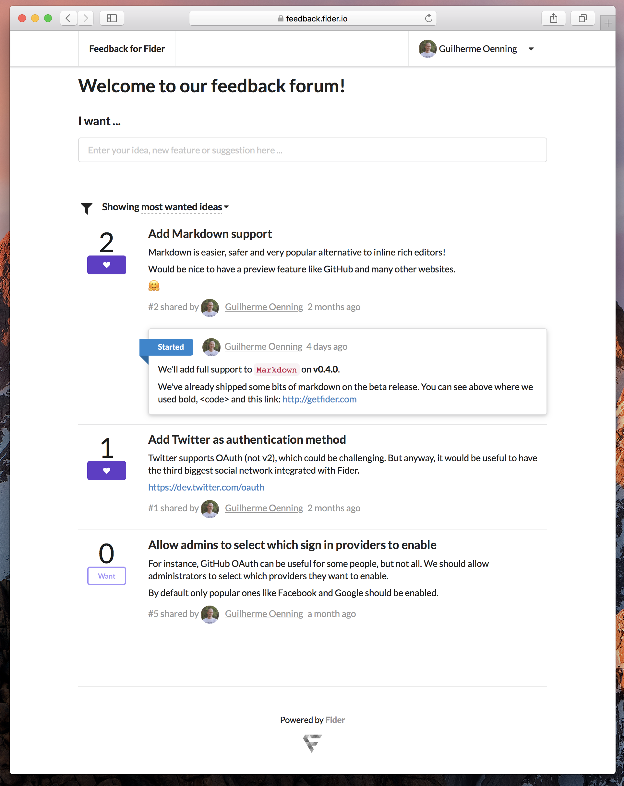

# What is Fider?

Visit http://getfider.com for information on what it is and how to use it.

# How to run it locally for development purpose?

Fider is mainly written in Go and TypeScript, but we're also using things like Node.js, React and PostgreSQL. 
If you know these technologies or would like to learn them, lucky you! This is the right place!

Tools you'll need:

- Go 1.8+ (https://golang.org)
- Node.js 6+ (https://nodejs.org/)
- Docker (https://www.docker.com/)
- github.com/codegangsta/gin (https://github.com/codegangsta/gin)

Step by step:

1) clone this repository into `$GOPATH/src/github.com/getfider/fider`
2) run `npm install` to install front end packages 
3) run `npm run build:watch` to pack the front end source into a bundle. It'll 
4) run `docker-compose up -d pgdev` to start a local PostgreSQL database on Docker.
5) run `cp .example.env .env` to create a local Environment configuration file.
6) run `make watch` to start the application.
7) Navigate to `http://localhost:3000/` and boom! Welcome to your new local Fider development copy!

Change some code, fix some bugs, implement some features and send us your Pull Request!

# How to run the tests

1) run `docker-compose up -d pgtest` to start a test-only PostgreSQL database on Docker.
2) run `make test`.