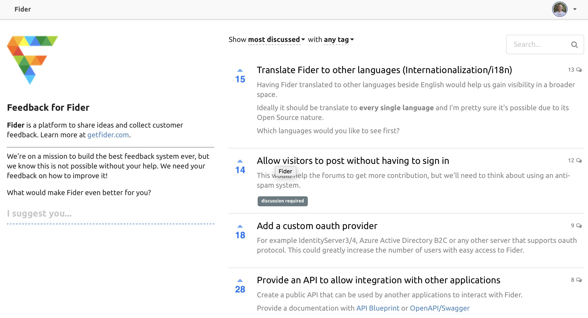

 

 

  
  

    <strong>Fider is a feedback portal for feature requests and suggestions.</strong>
  

  
Give your customers a voice and let them tell you what they need. Spend less time guessing and more time building the right product.

  <h3>
    <a href="https://feedback.fider.io/">
      See it in action
    </a>
     &middot; 
    <a href="https://fider.io">
      Learn more »
    </a>
  </h3>

  Created with ❤️ by <a href="https://github.com/goenning">Guilherme Oenning</a>, now maintained by <a href="https://github.com/mattwoberts">Matt Roberts</a> and supported by <a href="https://github.com/getfider/fider/graphs/contributors">contributors</a>

 
 

# Getting Started

## ☁️ **Fider Cloud**

The easiest and quickest way to get started. A fully managed services by the creators of Fider to help you get started in minutes. Forget about managing software updates and patches, we do it all for you! [Sign up now](https://fider.io/#get-started)

## 🏢 **Self-Hosted**

You can also install Fider yourself. It's free, but you are responsible for managing it. [Learn how](https://docs.fider.io/self-hosted/)

If you do self-host and enjoy Fider, please [let us know where you're using it](https://github.com/getfider/fider/issues/899) - we really appreciate it 🙏

 
 

# Sponsors

 
 

> Does your organization use Fider? [Become a sponsor](https://opencollective.com/fider) and get your logo and link on our README!

 
 

# Contributors

This project exists thanks to all the amazing people who contribute!

Read our [CONTRIBUTING](CONTRIBUTING.md) guide to learn how you can contribute to Fider.

 
 
