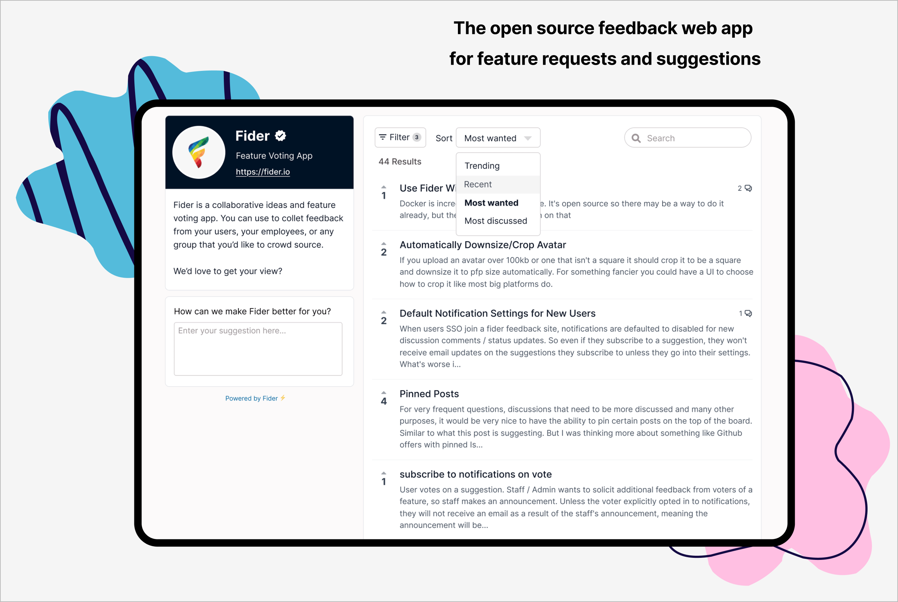

  

    <a href="https://fider.io/">Fider.io</a> •
    <a href="https://feedback.fider.io">Fider Feedback</a> •
    <a href="https://demo.fider.io">Fider Demo</a> •
    <a href="https://docs.fider.io">Docs</a> •
    <a href="https://github.com/TryGhost/Ghost/blob/main/.github/CONTRIBUTING.md">Contributing</a> •

 
 

 
 

# Fider is a feedback portal for feature requests and suggestions.

__Give your customers a voice and let them tell you what they need. Spend less time guessing and more time building the right product.__

# Getting Started

## ☁️ **Fider Cloud**

The easiest and quickest way to get started. A fully managed services by the creators of Fider to help you get started in minutes. Forget about managing software updates and patches, we do it all for you! [Sign up now](https://fider.io/#get-started)

## 🏢 **Self-Hosted**

Install Fider on your own servers, in your own infrastructure. It's totally free, but of course you're responsible for everything. [Learn how](https://docs.fider.io/self-hosted/)

If you do self-host and enjoy Fider, please [let us know where you're using it](https://github.com/getfider/fider/issues/899) - we really appreciate it 🙏

# 💰 Donations and Sponsors

Supoprt the development of Fider to help us make it the best feedback tool! You can set up donations as small or large as you want to help us keep Fider going. [Donate](https://opencollective.com/fider)

If your organization uses Fider, consider becoming a sponsor - set up a monthly donation and get your logo and link on the README. [Become a sponsor](https://opencollective.com/fider)

 
 

# Contributors

This project exists thanks to all the amazing people who contribute!

Read our [CONTRIBUTING](CONTRIBUTING.md) guide to learn how you can contribute to Fider.

 
 
